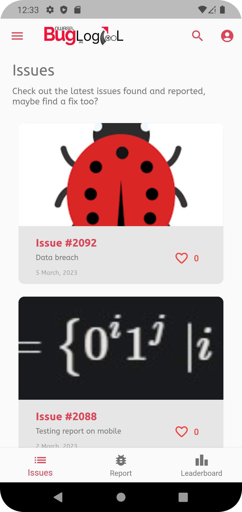

# OWASP BLT

`Report Bugs, Secure the Web and Win Points!`

  
  
  
  

---

### Check exiting issues.
Find the bugs and issues in current websites, maybe help fixing 'em too?

### Report Bugs
Heist those sneaky bugs on different websites and apps & report them. Get points too, companies are held accountable!

### Get Renowned
Fight with other like minded bug and bounty hunters across the word to get on top of the leaderboard!

### Start bughunts
Are you a an organization looking for finding bugs on your website or app? Launch your bug hunt programs with prize pools for bug hunters to find all those little bugs possible!

## About BLT

OWASP BLT (Bug Logging Tool) is a powerful tool designed to allow everyone who uses the internet to help improve it. With BLT, users can submit any type of issue they encounter, whether it’s a simple design flaw like a button being the wrong color, or a serious security vulnerability. Read more about [BLT](https://owasp.org/www-project-bug-logging-tool/) 

## Contributing
We welcome any contributions big or small. To start contributing, start with anything like opening an issue, pull request, suggesting a documentation etc.

__If you want to see a complete Contribution Guide, check it out [here.](./CONTRIBUTING.md)__

_Please make sure `flutter analyze` works before submitting the pull request._

- ### New to flutter?
    A few resources to get you started:

    - [Lab: Write your first Flutter app](https://flutter.dev/docs/get-started/codelab)
    - [Cookbook: Useful Flutter samples](https://flutter.dev/docs/cookbook)

- ### Are you a designer?
    We got your back! If you want to help up with the UI mockups, design and prototyping refer the below links:
    - Coming soon!

### Documentation
Check the API documentation for BLT below:

- Swagger API Documentations can be found at the root domain /swagger/
- Postman API Documentations: [Postman Docs](https://documenter.getpostman.com/view/19782933/VUqpscyV).

### Resources
- Join the [OWASP Slack Channel](https://owasp.org/slack/invite) and ask questions at **#project-blt**
- Github activity can be seen in Slack **#blt-github**.

### Other BLT Projects
Also check out other BLT projects!

- [OWASP/BLT](https://www.github.com/OWASP/BLT)
- [OWASP/BLT-Extension](https://www.github.com/OWASP/BLT-Extension)
- [OWASP/BLT-Bacon](https://www.github.com/OWASP/BLT-Bacon)
- [OWASP/BLT-Action](https://www.github.com/OWASP/BLT-Action)  

### License
The BLT code is released under [GNU Affero General Public License v3.0 (AGPL-3.0)](https://github.com/OWASP/BLT/blob/master/LICENSE).

## Notes
- If you find a bug or have an improvement, use BLT to report it!
- For each new issue, create a new branch with `issue-#issueNo`, when you commit add `fixes #issueNo` to link the issue to the pull request
- To take a github issue type a comment that says "assign to me" or /assign and it will assign it to you.
