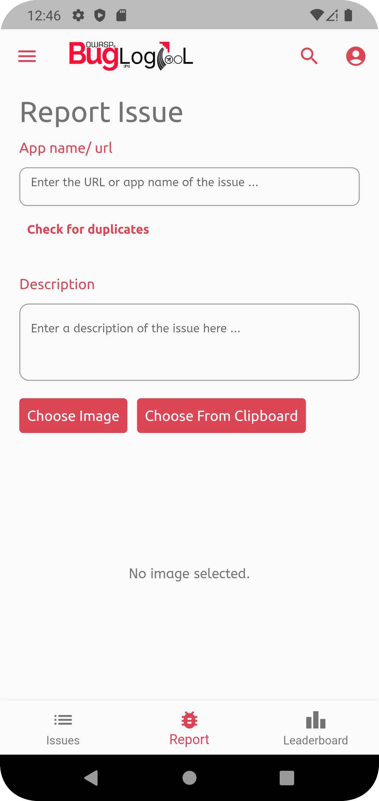

     

 

 

## BugHeist Mobile App
`Report Issues, Win Prizes!`

     
     &emsp;
     &emsp;
     &emsp;
     &emsp;
      

### Check exiting issues
Find the bugs and issues in current websites, maybe help fixing 'em too?

### Report Bugs
Heist those sneaky bugs on different websites and apps & report them. Get rewards too, companies are held accountable!

### Get Renowned
Fight with other like minded bug and bounty hunters across the word to get on top of the leaderboard!

## About BugHeist
BugHeist is a bug-hunting & logging tool which allows you, the user or company to hunt for bugs, claim bug hounties and allow you to start bughunting spree/contest respectively. The best part? All of it is opensourced!

## Contributing
We welcome any contributions big or small. To start contributing, start with anything like opening an issue, pull request, suggesting a documentation etc.

_Please make sure flutter analyze works before submitting the pull request._

- ### New to flutter?
    A few resources to get you started:

    - [Lab: Write your first Flutter app](https://flutter.dev/docs/get-started/codelab)
    - [Cookbook: Useful Flutter samples](https://flutter.dev/docs/cookbook)

- ### Are you a designer?
    We got your back! If you want to help up with the UI mockups, design and prototyping refer the below links:

    - New Design file: https://www.figma.com/file/NYD5WZzJywnO338lchnece/BugHeist?node-id=7%3A634
    - Old design file: https://www.figma.com/file/s0xuxeU6O2guoWEfA9OElZ/Bugheist-Full-Design?node-id=513%3A771
    
 

_Looking for the BugHeist website? Check it out [here](https://www.bugheist.com)!_
